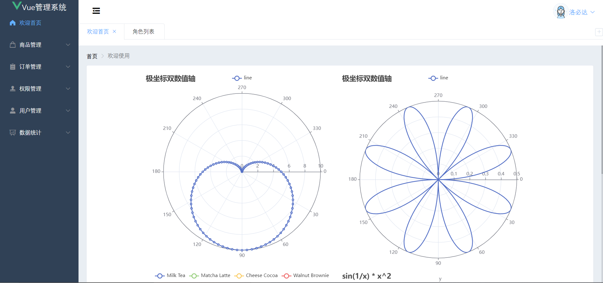
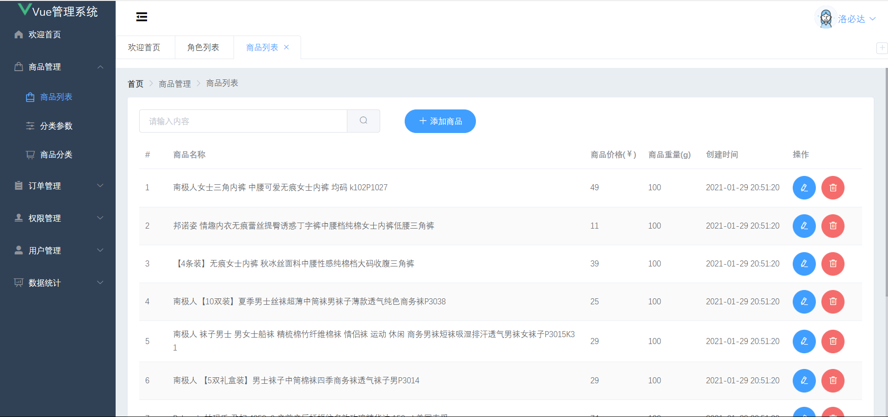
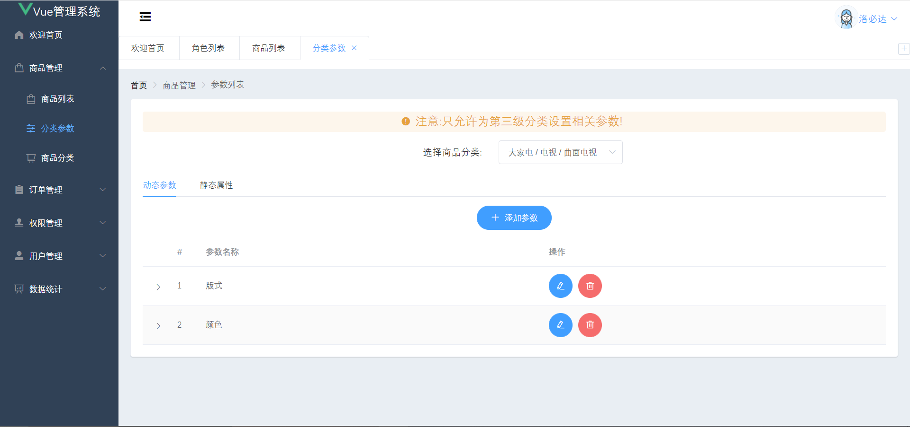
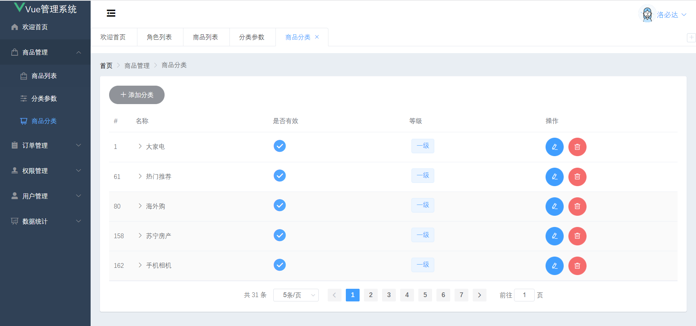
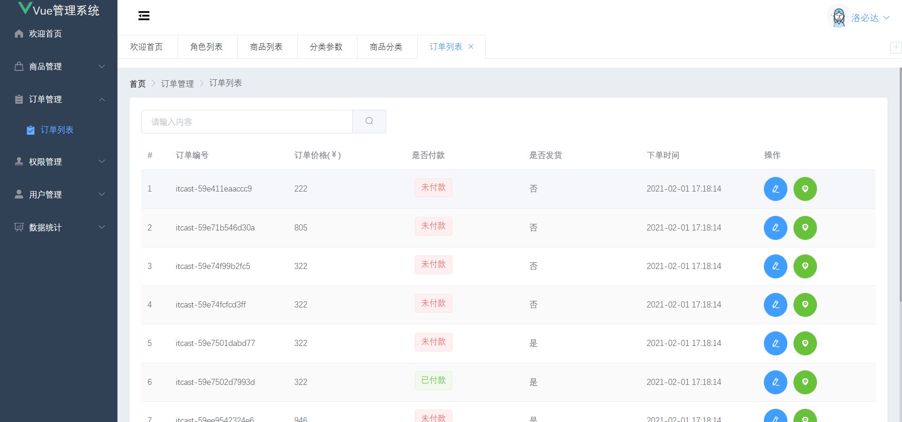
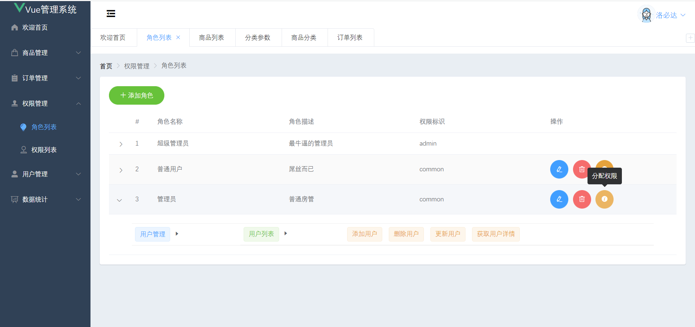
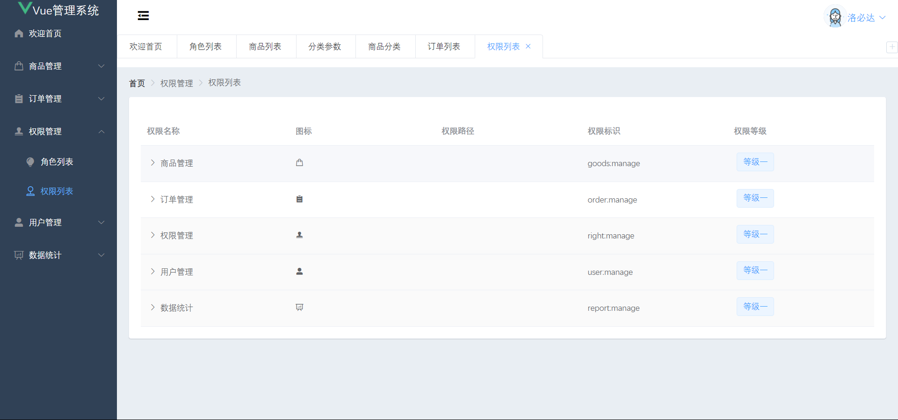
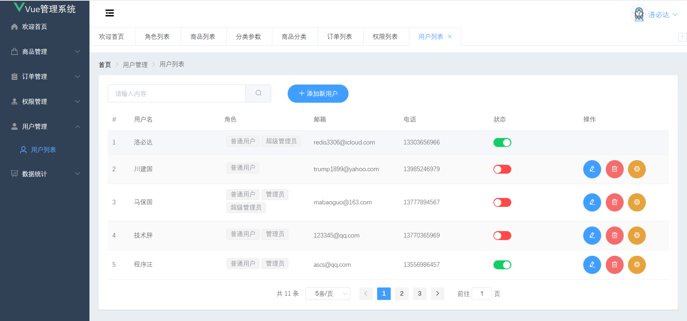
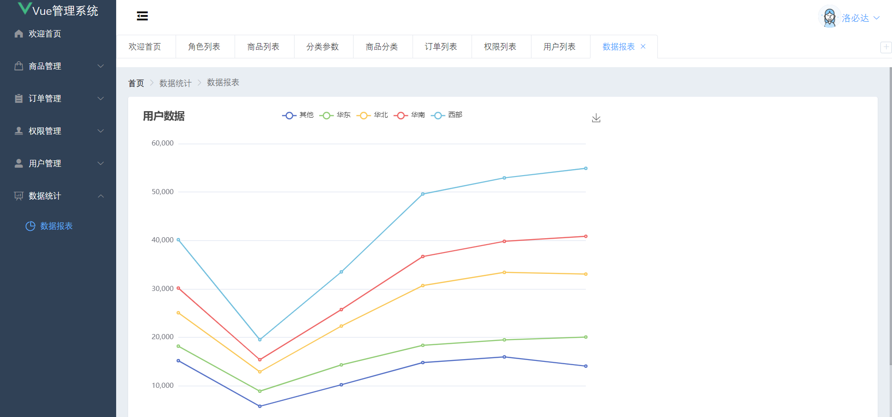
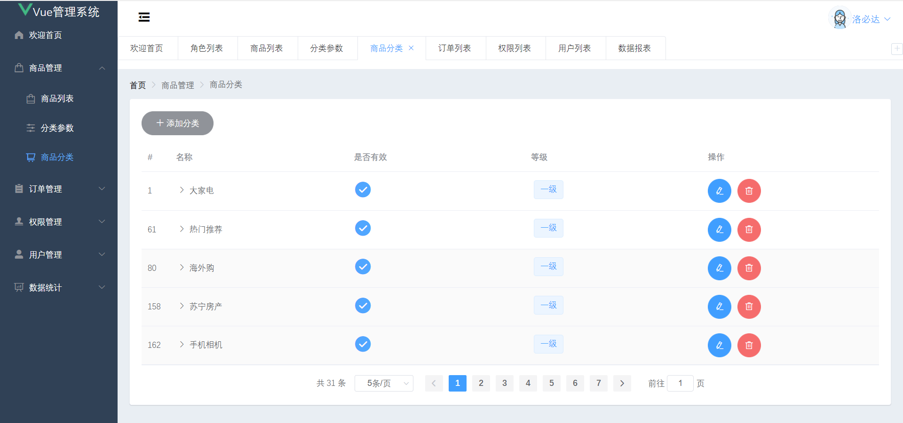

# 项目介绍
这是一个使用VueCLI构建的前后端分离式通用的后台管理系统,实现了最基本的用户管理,角色管理,权限管理等功能.本项目使用ElementUI构建页面,ElementUI提供了丰富的组件库可以快速搭建前端应用.后端使用SpringBoot实现,权限管理基于SpringSecurity和JWT实现,数据持久层使用了MybatisPlus,简化了CRUD操作,后端仓库是vue-manange-spring感兴趣可以前去查看.

# 技术栈
| 名称                         | 版本号  |
|-----------------------------|---------|
| core-js                     | ^3.6.5  |
| echarts                     | ^5.0.1  |
| element-ui                  | ^2.4.5  |
| nprogress                   | ^0.2.0  |
| vue                         | ^2.6.11 |
| vue-monoplasty-slide-verify | ^1.1.3  |
| vue-router                  | ^3.2.0  |
| vuex                        | ^3.6.2  |
| axios                       | ^0.18.0 |

# 项目截图
| | |
|-----------------------------|---------|
|   |   |
|   |   |
|   |   |
|   |   |
|   |   |

