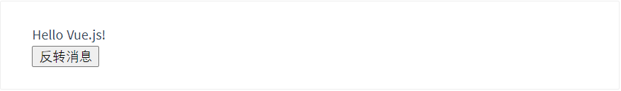
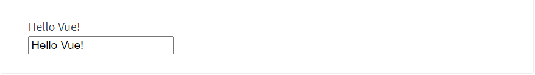
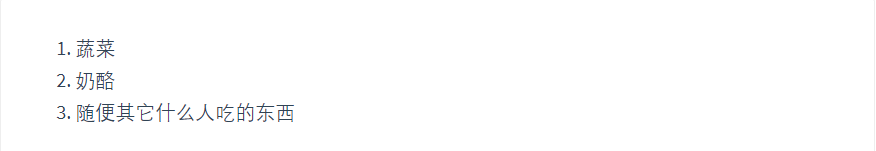

# 一. 简介

本项目是一个Vue.js实战项目,使用到Vue框架的基本语法以及一些前端常用的库,基于Vue的脚手架构建,通过本项目,你可以了解到Vue的实战应用以及一些进阶的JS语法.

# 二. MVVM架构

## 2.1 什么是MVVM?

MVVM是Model-View-ViewModel的简写。它本质上就是MVC 的改进版。MVVM 就是将其中的View 的状态和行为抽象化，让我们将视图 UI 和业务逻辑分开。当然这些事 ViewModel 已经帮我们做了，它可以取出 Model 的数据同时帮忙处理 View 中由于需要展示内容而涉及的业务逻辑。微软的WPF带来了新的技术体验，如Silverlight、音频、视频、3D、动画……，这导致了软件UI层更加细节化、可定制化。同时，在技术层面，WPF也带来了 诸如Binding、Dependency Property、Routed Events、Command、DataTemplate、ControlTemplate等新特性。MVVM（Model-View-ViewModel）框架的由来便是MVP（Model-View-Presenter）模式与WPF结合的应用方式时发展演变过来的一种新型架构框架。它立足于原有MVP框架并且把WPF的新特性糅合进去，以应对客户日益复杂的需求变化。


上图描述了MVVM一个基本结构，看到了什么，是不是**发现比MVC架构中多了一个ViewModel**，没错，就是这个ViewModel，他是MVVM相对于MVC改进的核心思想。在开发过程中，由于需求的变更或添加，项目的复杂度越来越高，代码量越来越大，此时我们会发现MVC维护起来有些吃力，首先被人吐槽的最多的就是MVC的简写变成了Massive-View-Controller（意为沉重的Controller）

由于Controller主要用来处理各种逻辑和数据转化，复杂业务逻辑界面的Controller非常庞大，维护困难，所以有人想到**把Controller的数据和逻辑处理部分从中抽离出来，用一个专门的对象去管理，这个对象就是ViewModel，是Model和Controller之间的一座桥梁**。当人们去尝试这种方式时，发现Controller中的代码变得非常少，变得易于测试和维护，只需要**Controller和ViewModel做数据绑定**即可，这也就催生了MVVM的热潮。


## 2.2 MVVM的优点

MVVM模式和MVC模式一样，主要目的是分离视图（View）和模型（Model），有几大优点

**1. 低耦合**。视图（View）可以独立于Model变化和修改，一个ViewModel可以绑定到不同的"View"上，当View变化的时候Model可以不变，当Model变化的时候View也可以不变。

**2. 可重用性**。你可以把一些视图逻辑放在一个ViewModel里面，让很多view重用这段视图逻辑。

**3. 独立开发**。开发人员可以专注于业务逻辑和数据的开发（ViewModel），设计人员可以专注于页面设计，使用Expression Blend可以很容易设计界面并生成xaml代码。

**4. 可测试**。界面素来是比较难于测试的，测试可以针对ViewModel来写。


# 三. Vue.js快速入门

## 3.1 Vue.js是什么?

Vue (读音 /vjuː/，类似于 **view**) 是一套用于构建用户界面的**渐进式框架**。与其它大型框架不同的是，Vue 被设计为可以自底向上逐层应用。Vue 的核心库只关注视图层，不仅易于上手，还便于与第三方库或既有项目整合。另一方面，当与现代化的工具链以及各种支持类库结合使用时，Vue 也完全能够为复杂的单页应用提供驱动。

## 3.2 起步安装

以如下方式引入Vue.js,分别是开发环境和生产环境

```html
<!-- 开发环境版本，包含了有帮助的命令行警告 -->
<script src="https://cdn.jsdelivr.net/npm/vue@2/dist/vue.js"></script>
<!-- 生产环境版本，优化了尺寸和速度 -->
<script src="https://cdn.jsdelivr.net/npm/vue@2"></script>
```

## 3.3 声明式编程

### 3.3.1 声明式渲染

Vue.js 的核心是一个允许采用简洁的模板语法来声明式地将数据渲染进 DOM 的系统：

```html
<div id="app">
  {{ message }}
</div>
```

```js
const app = new Vue({
  el: '#app',
  data: {
    message: 'Hello Vue!'
  }
})
```

```
Hello Vue!
```

### 3.3.2 条件与循环

`v-if`**指令可以用来控制是否显示一个元素**

```html
<div id="app-3">
  <p v-if="seen">现在你看到我了</p>
</div>
```

```js
const app3 = new Vue({
  el: '#app-3',
  data: {
    seen: true
  }
})
```

```
现在你看到我了
```


继续在控制台输入 `app3.seen = false`，你会发现之前显示的消息消失了。

`v-for` **指令可以绑定数组的数据来渲染一个项目列表：**

```html
<div id="app-4">
  <ol>
    <li v-for="todo in todos">
      {{ todo.text }}
    </li>
  </ol>
</div>
```

```js
const app4 = new Vue({
  el: '#app-4',
  data: {
    todos: [
      { text: '学习 JavaScript' },
      { text: '学习 Vue' },
      { text: '整个牛项目' }
    ]
  }
})
```

```
1. 学习JavaScript
2. 学习Vue
3. 整个牛项目
```

### 3.3.3 处理用户输入

为了让用户和你的应用进行交互，我们可以用 `v-on` 指令添加一个事件监听器，**通过它调用在 Vue 实例中定义的方法**

```html
<div id="app-5">
  <p>{{ message }}</p>
  <button v-on:click="reverseMessage">反转消息</button>
</div>
```

```js
const app5 = new Vue({
  el: '#app-5',
  data: {
    message: 'Hello Vue.js!'
  },
  methods: {
    reverseMessage: function () {
      this.message = this.message.split('').reverse().join('')
    }
  }
})
```



注意在 `reverseMessage` 方法中，我们更新了应用的状态，但没有触碰 DOM——所有的 DOM 操作都由 Vue 来处理，你编写的代码只需要关注逻辑层面即可。

### 3.3.4 数据双向绑定

Vue 还提供了 `v-model` 指令，**它能轻松实现表单输入和应用状态之间的双向绑定。**

```html
<div id="app-6">
  <p>{{ message }}</p>
  <input v-model="message">
</div>
```

```js
const app6 = new Vue({
  el: '#app-6',
  data: {
    message: 'Hello Vue!'
  }
})
```



### 3.3.5 组件化应用构建

组件系统是 Vue 的另一个重要概念，因为它是一种抽象，允许我们使用小型、独立和通常可复用的组件构建大型应用。仔细想想，几乎任意类型的应用界面都可以抽象为一个组件树：


在 Vue 中注册组件很简单：

```js
// 定义名为 todo-item 的新组件
Vue.component('todo-item', {
  template: '<li>这是个待办项</li>'
})

const app = new Vue(...)
```

用它构建另一个组件模板：

```html
<ol>
  <!-- 创建一个 todo-item 组件的实例 -->
  <todo-item></todo-item>
</ol>
```

但是这样会为每个待办项渲染同样的文本，这看起来并不炫酷。我们应该能从父作用域将数据传到子组件才对。让我们来修改一下组件的定义，使之能够接受一个 prop：

```js
Vue.component('todo-item', {
  // todo-item 组件现在接受一个
  // "prop"，类似于一个自定义 attribute。
  // 这个 prop 名为 todo。
  props: ['todo'],
  template: '<li>{{ todo.text }}</li>'
})
```

使用 `v-bind` 指令将待办项传到循环输出的每个组件中：

```html
<div id="app-7">
  <ol>
    <!--
      现在我们为每个 todo-item 提供 todo 对象
      todo 对象是变量，即其内容可以是动态的。
      我们也需要为每个组件提供一个“key”，稍后再
      作详细解释。
    -->
    <todo-item
      v-for="item in groceryList"
      v-bind:todo="item"
      v-bind:key="item.id"
    ></todo-item>
  </ol>
</div>
```

```js
Vue.component('todo-item', {
  props: ['todo'],
  template: '<li>{{ todo.text }}</li>'
})

const app7 = new Vue({
  el: '#app-7',
  data: {
    groceryList: [
      { id: 0, text: '蔬菜' },
      { id: 1, text: '奶酪' },
      { id: 2, text: '随便其它什么人吃的东西' }
    ]
  }
})
```



