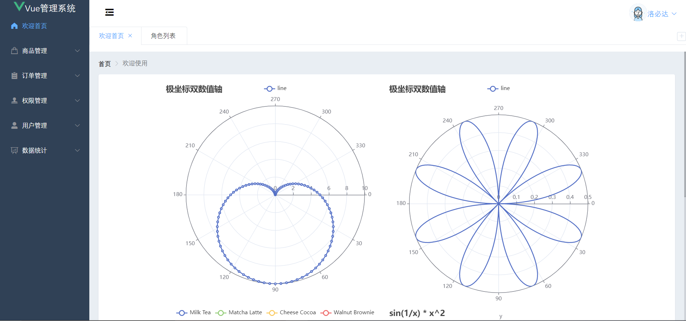
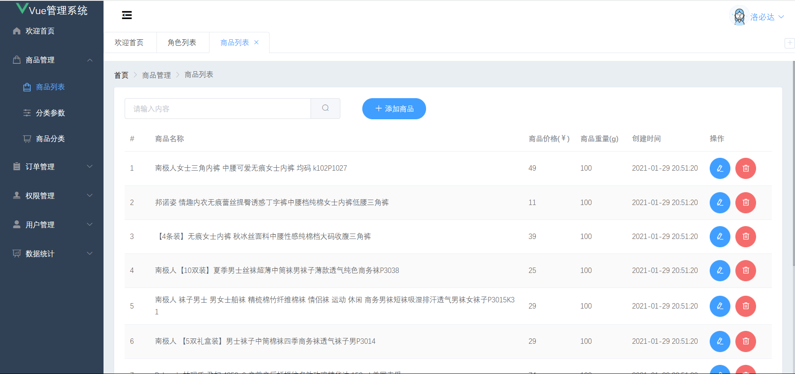
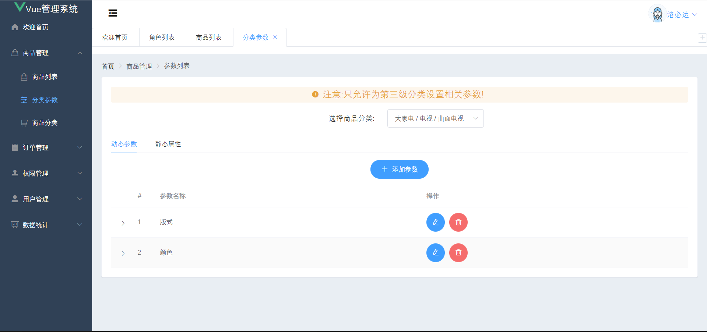
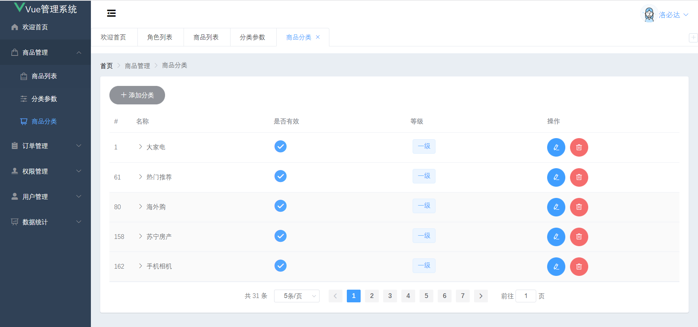
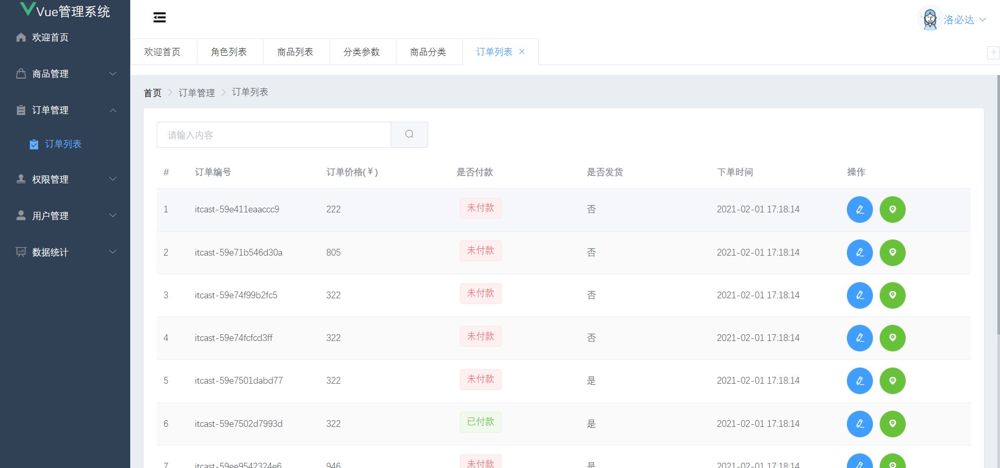
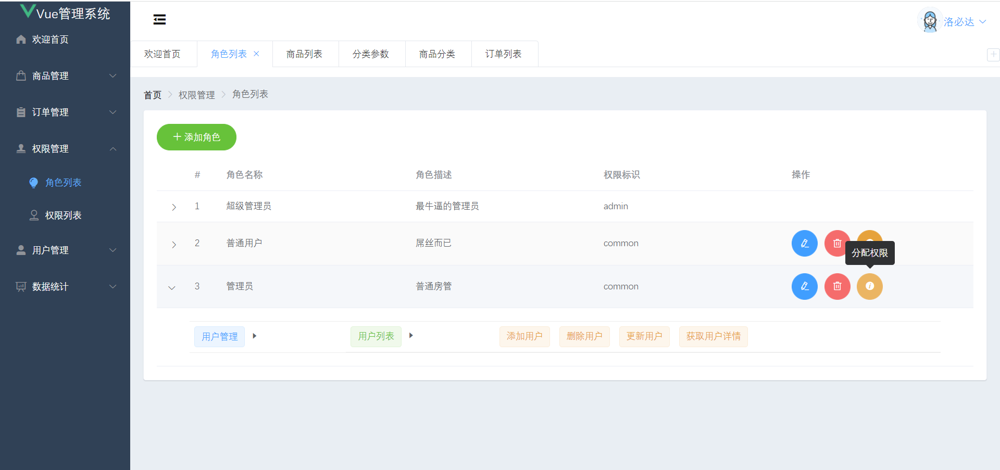
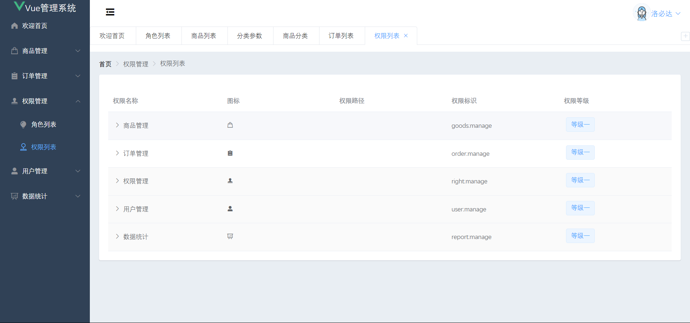
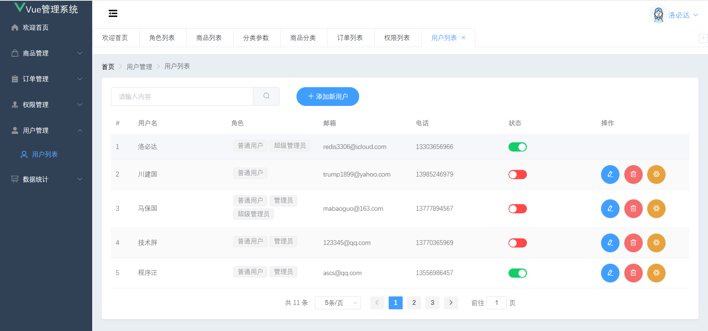
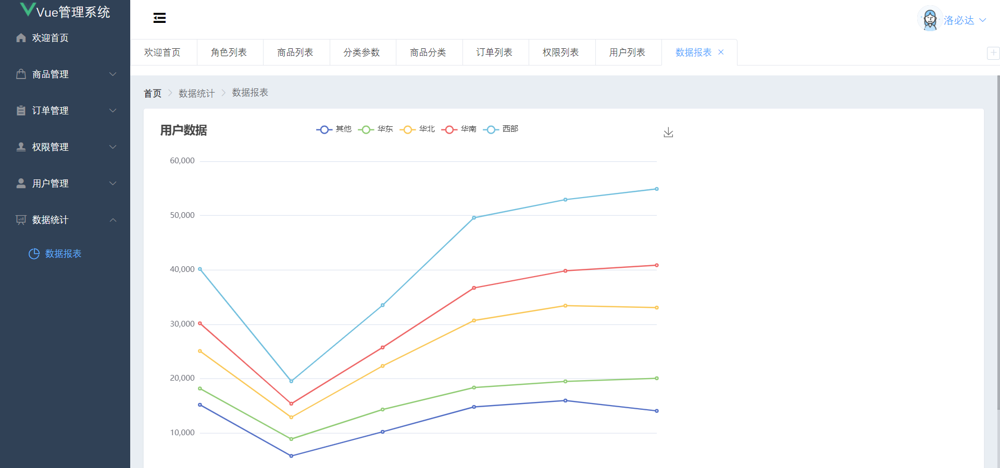
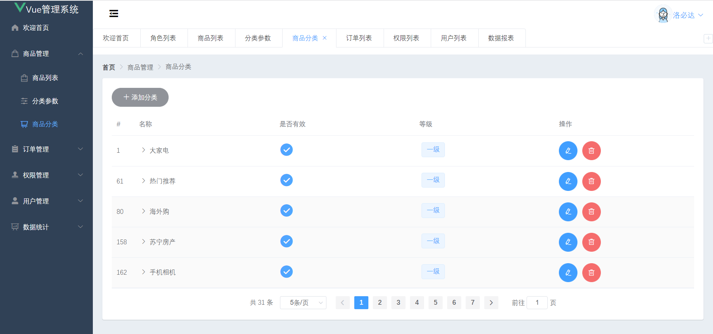

# 一. 简介

本项目是一个Vue.js实战项目,使用到Vue框架的基本语法以及一些前端常用的库,基于Vue的脚手架构建,通过本项目,你可以了解到Vue的实战应用以及一些进阶的JS语法.

# 二. MVVM架构

## 2.1 什么是MVVM?

MVVM是Model-View-ViewModel的简写。它本质上就是MVC 的改进版。MVVM 就是将其中的View 的状态和行为抽象化，让我们将视图 UI 和业务逻辑分开。当然这些事 ViewModel 已经帮我们做了，它可以取出 Model 的数据同时帮忙处理 View 中由于需要展示内容而涉及的业务逻辑。微软的WPF带来了新的技术体验，如Silverlight、音频、视频、3D、动画……，这导致了软件UI层更加细节化、可定制化。同时，在技术层面，WPF也带来了 诸如Binding、Dependency Property、Routed Events、Command、DataTemplate、ControlTemplate等新特性。MVVM（Model-View-ViewModel）框架的由来便是MVP（Model-View-Presenter）模式与WPF结合的应用方式时发展演变过来的一种新型架构框架。它立足于原有MVP框架并且把WPF的新特性糅合进去，以应对客户日益复杂的需求变化。

上图描述了MVVM一个基本结构，看到了什么，是不是**发现比MVC架构中多了一个ViewModel**，没错，就是这个ViewModel，他是MVVM相对于MVC改进的核心思想。在开发过程中，由于需求的变更或添加，项目的复杂度越来越高，代码量越来越大，此时我们会发现MVC维护起来有些吃力，首先被人吐槽的最多的就是MVC的简写变成了Massive-View-Controller（意为沉重的Controller）

由于Controller主要用来处理各种逻辑和数据转化，复杂业务逻辑界面的Controller非常庞大，维护困难，所以有人想到**把Controller的数据和逻辑处理部分从中抽离出来，用一个专门的对象去管理，这个对象就是ViewModel，是Model和Controller之间的一座桥梁**。当人们去尝试这种方式时，发现Controller中的代码变得非常少，变得易于测试和维护，只需要**Controller和ViewModel做数据绑定**即可，这也就催生了MVVM的热潮。

## 2.2 MVVM的优点

MVVM模式和MVC模式一样，主要目的是分离视图（View）和模型（Model），有几大优点

**1. 低耦合**。视图（View）可以独立于Model变化和修改，一个ViewModel可以绑定到不同的"View"上，当View变化的时候Model可以不变，当Model变化的时候View也可以不变。

**2. 可重用性**。你可以把一些视图逻辑放在一个ViewModel里面，让很多view重用这段视图逻辑。

**3. 独立开发**。开发人员可以专注于业务逻辑和数据的开发（ViewModel），设计人员可以专注于页面设计，使用Expression Blend可以很容易设计界面并生成xaml代码。

**4. 可测试**。界面素来是比较难于测试的，测试可以针对ViewModel来写。

# 三. 项目截图

|  |  |
| ----------------------------------- | ----------------------------------- |
|  |  |
|  |  |
|  |  |
|  |  |

